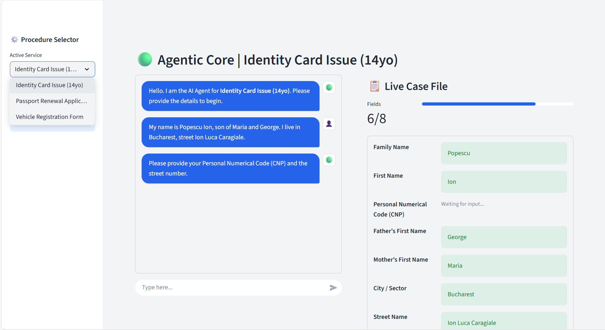

# 🟢 Civil Servant Agent


**Civil Servant Agent** is an AI-powered interface designed to modernize bureaucratic processes. It acts as an intelligent layer between citizens and government forms, converting natural conversation into structured data and automatically generating filled PDF applications.

---

## 📸 Interface



## ✨ Key Features

* **🧠 Universal AI Agent:** A smart conversationalist that understands intent and extracts entities from natural language to fill complex forms.
* **⚡ Live Case File:** A real-time dashboard that updates instantly as the user chats, visualizing completed fields and pending requirements.
* **📂 Multi-Service Support:** Dynamically switch between procedures (e.g., *Identity Card*, *Passport*, *Driver's License*) with context retention.
* **📄 Automated PDF Generation:** Maps extracted data directly to official government PDF templates using a robust backend handler.
* **🎨 Custom UI:** A clean, dual-pane layout (Chat vs. Data) with custom CSS styling and progress tracking.

---

## 🚀 Quick Start

### Prerequisites
* Python 3.9+
* Pip

### Installation

1.  **Clone the repository**
    ```bash
    git clone [https://github.com/YOUR_USERNAME/agentic-gov.git](https://github.com/YOUR_USERNAME/agentic-gov.git)
    cd agentic-gov
    ```

2.  **Install dependencies**
    ```bash
    pip install -r requirements.txt
    ```

3.  **Run the application**
    ```bash
    streamlit run main.py
    ```

---

## 🛠️ Project Structure

```text
agentic-gov/
├── main.py              # The Streamlit Entry Point (Frontend)
├── assets/
│   └── styles.css       # Custom UI styling
├── src/
│   ├── __init__.py
│   ├── agent.py         # UniversalAgent logic (LLM integration)
│   ├── services.py      # Configuration for forms (Service Definitions)
│   └── pdf_handler.py   # PDF filling logic
├── templates/           # Folder for blank PDF forms
│   └── application.pdf  
└── requirements.txt     # Python dependencies
